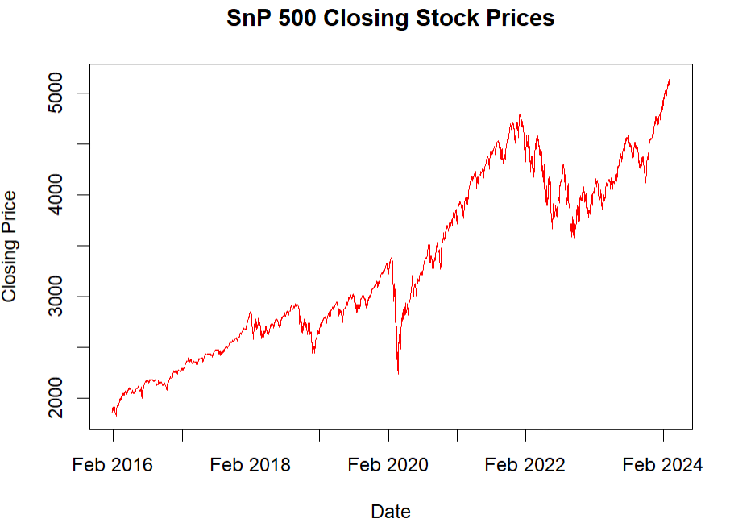
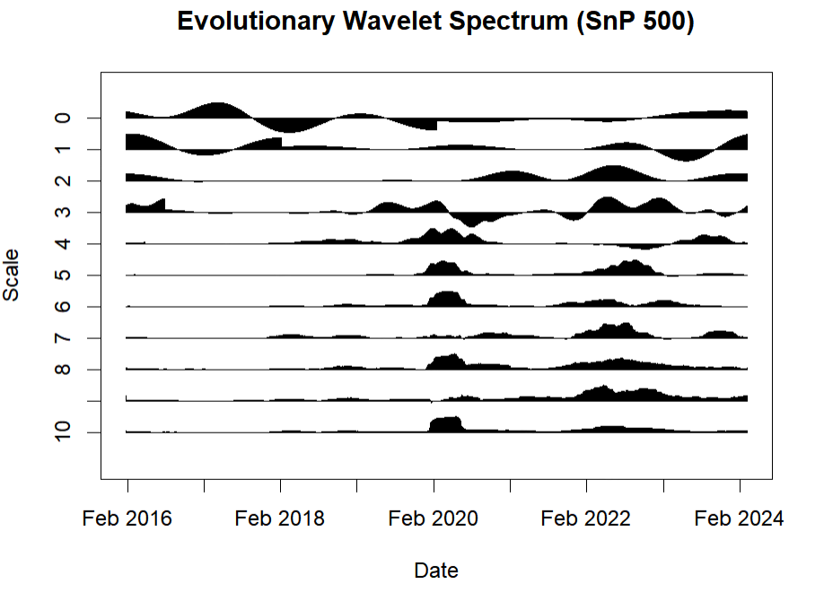

# Wavelet Analysis of Non-Stationary Financial Time Series Data

This project applies wavelet analysis to address the challenges posed by the non-stationarity of financial time series. We performed a time-scale analysis of two major stock indexes in R utilizing the R package `wavethresh`, developed by Guy Nason.

Specifically, we have investigated the market dynamics of the SnP 500 and FTSE 100 datasets over the period of February 2016-February 2024.

### Key Contributions:
- **Time-Scale Analysis:** We utilized the Evolutionary Wavelet Spectrum (EWS) to analyze the S&P 500 and FTSE 100 indexes, providing insights into variance over time at different scales.
- **Market Volatility:** The analysis identified key periods of stock market volatility, including the impact of the COVID-19 pandemic in 2020 and the 2018 market fluctuations driven by interest rate changes and regulatory scrutiny on big tech.
- **Multiscale Visualization:** The multiscale nature of wavelet analysis allowed us to effectively visualize volatility across different time scales, offering a clear view of both short-term fluctuations and long-term trends.
- **Localized Autocorrelation:** By examining localized autocorrelations, we uncovered underlying linear relationships between lagged observations, enhancing the understanding of market dynamics.
- **Historical Corroboration:** The results were consistent with real historical events and economic factors, confirming the reliability of the wavelet approach in capturing market behavior.

This project demonstrates the effectiveness of wavelet methodologies in financial time series analysis, providing detailed insights and visualizations of market behavior across various time scales. A more detailed explanation of the entire project, along with a thorough analysis and insights drawn, is provided in my Master's Dissertation, which is also included in this repository for completeness.
